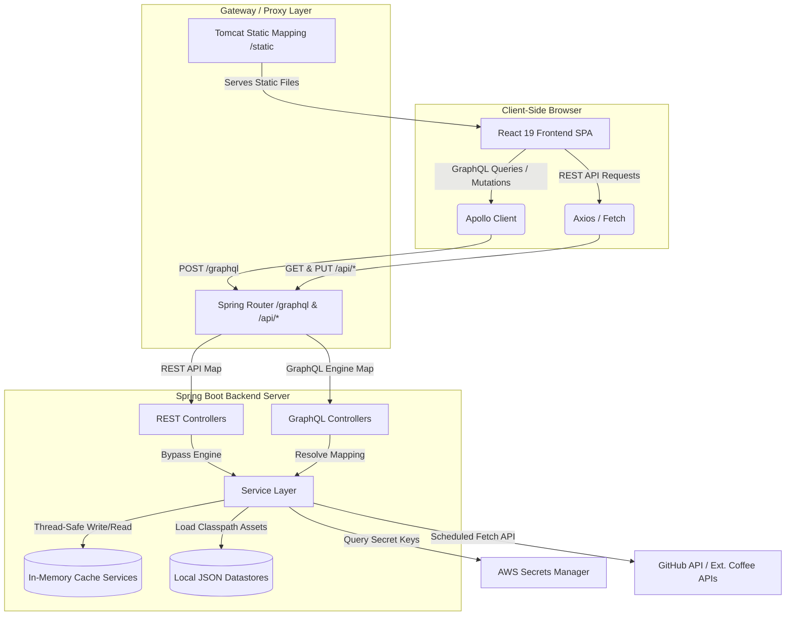
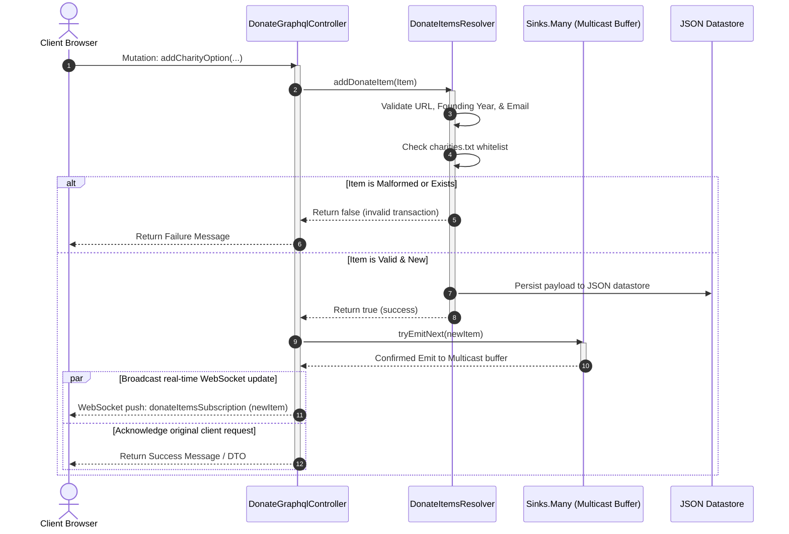
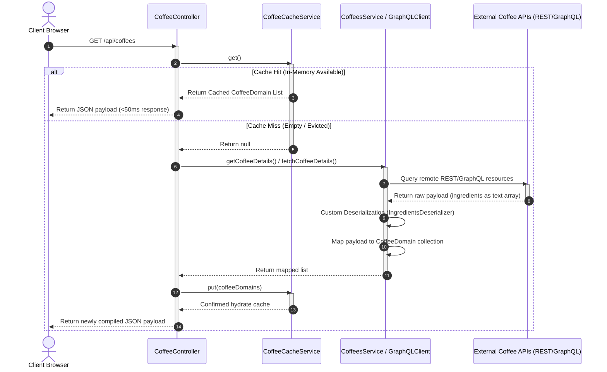

# iRonoc Portfolio Application - Full Stack Architecture & Data Flows

This document delivers a comprehensive, highly granular technical breakdown of the **iRonoc** architecture. It spans the system architecture, frontend structure, granular backend service layer, and showcases deep functional flow sections for **Donate Items**, **Portfolio Items**, and **Brews/Coffee** subsystems.

---

## 1. High-Level System Architecture

The iRonoc portfolio platform is structured as a decoupled, multi-tier full-stack application. It integrates a high-performance **Java 25 / Spring Boot** backend (embedded Tomcat) with a responsive, client-side routed **React 19** single-page application (SPA).

```
+---------------------------------------------------------------------------------------------------+
|                                       Client Web Browser                                          |
|  - Renders UI elements (React 19, Material UI 7, Bootstrap 5)                                     |
|  - Triggers Client-Side Routes, REST Calls, and real-time GraphQL Subscription streams            |
+-------------------------------------------------+-------------------------------------------------+
                                                  |
                                                  | HTTP / HTTPS / WSS (WebSockets)
                                                  v
+---------------------------------------------------------------------------------------------------+
|                                      Gateway / Proxy Layer                                        |
|  - Serves compiled, static frontend bundles (.js, .css, .html) from Tomcat /static mapping        |
|  - Reverse-proxies API endpoints (/api/*) and GraphQL gateways (/graphql) to active servlet hooks |
+-------------------------------------------------+-------------------------------------------------+
                                                  |
                                                  v
+---------------------------------------------------------------------------------------------------+
|                                Spring Boot Backend (Tomcat)                                       |
|                                                                                                   |
|   +---------------------------------------+       +-------------------------------------------+   |
|   |          REST Controllers             |       |            GraphQL Controllers            |   |
|   |  - DonateRestController               |       |  - DonateGraphqlController (Sinks.Many)   |   |
|   |  - CoffeeController                   |       |  - BrewGraphqlController                  |   |
|   |  - ActivityTrackingController         |       |  - PortfolioItemsResolver (QueryMapping)  |   |
|   +-------------------+-------------------+       +-------------------+-----------------------+   |
|                       |                                               |                           |
|                       +-----------------------+-----------------------+                           |
|                                               |                                                   |
|                                               v                                                   |
|   +-------------------------------------------------------------------------------------------+   |
|   |                         Granular Backend Service & Resolver Layer                         |   |
|   |  - GitDetailsService (GitHub REST engine)                                                 |   |
|   |  - CoffeesService (REST Coffee parser) / GraphQLClientService (Custom GraphQL Client)     |   |
|   |  - In-Memory Caches: GitRepoCacheService, GitProjectCacheService, CoffeeCacheService      |   |
|   |  - Resolvers: DonateItemsResolver, PortfolioItemsResolver                                 |   |
|   +-------------------------------------------+-----------------------------------------------+   |
|                                               |                                                   |
+-----------------------------------------------v---------------------------------------------------+
                                                |
                      +-------------------------+-------------------------+
                      |                                                   |
                      v                                                   v
+---------------------------------------+       +---------------------------------------+
|          AWS Secrets Manager          |       |           Third-Party APIs            |
| - Retrieves GitHub personal keys      |       | - GitHub API (Issues, Repositories)   |
| - Secures backend configurations      |       | - External Coffee API REST/GraphQLs   |
+---------------------------------------+       +---------------------------------------+
```

---

## 2. Technical Sequence & Workflow Diagrams

These diagrams can be visualized natively inside IntelliJ IDEA (using the diagram viewer plugin), GitHub, or standard markdown readers.

### 1. High-Level System Components & Services Flow
This flowchart maps the primary components and structural dependencies from client interface to datastores and remote services.



### 2. Donate Subsystem: Mutation & WebSocket Broadcast Sequence
This sequence diagram tracks the full transactional life cycle when a user registers a new charity, from validation to real-time sync.



### 3. Brews/Coffee Retrieval & Caching Flow
This sequence diagram details the fallback and deserialization pipeline when querying coffee brewing instructions.



---

## 3. Charity & Donation Subsystem (Primary Feature)

The Charity and Donation subsystem is a primary component of the iRonoc platform. It delivers real-time charity registration, cryptographic verification, and reactive synchronization between multiple client browsers and the datastore.

```
 [ Client: Donate.js ]        [ Spring Controllers ]       [ DonateItemsResolver ]      [ Datastore / Disk ]
           |                            |                             |                           |
           |---- GraphQL Query -------->|                             |                           |
           |   (getDonateItems)         |---- getDonateItems() ------>|                           |
           |                            |                             |---- load classpath ------>| [ donate-items.json ]
           |                            |                             |---- validate year/URLs -->| [ charities.txt ]
           |<--- JSON Charity List -----|<--- filtered list ----------|                           |
           |                            |                             |                           |
           |                            |                             |                           |
           |---- GraphQL Mutation ----->|                             |                           |
           |   (addCharityOption)       |---- addDonateItem(Item) --->|                           |
           |                            |                             |--- write to class resource| [ donate-items.json ]
           |                            |                             |                           |
           |                            |--- Sink: tryEmitNext()      |                           |
           |<--- Mutated Confirmation --|      (Broadcast to WS)      |                           |
           |                            |                             |                           |
```

### 1. User Interface (`components/Donate.js`)
The React frontend component renders a responsive Material-UI and Bootstrap grid layout of active, trusted charity options:
- **Presentation**: Renders card tiles featuring custom logos (`img`), summary descriptions (`overview`), founding years, and validated telephone lines. Clicking a card directs the browser to the charity's official donation portal.
- **Initial Query Hydration**: Uses Apollo Client's query executor (`client.query`) on mounting to perform initial pull-hydration of charity cards directly from `/graphql`.
- **Active Subscription Stream**: Implements a persistent, real-time WebSocket GraphQL Subscription (`client.subscribe` listening to `DONATE_ADDED_SUBSCRIPTION` mapping to `donateItemsSubscription`). This dynamically appends new cards pushed by the backend `Sinks.Many` multicast sink to the browser carousel list instantly without requiring full page fetches, polling, or Axios requests.
- **Dynamic Registration Form**: Renders a dedicated modal with validation warnings matching the backend regex engines (valid year between 1000–2100, valid telephone format or email structure, and HTTP/HTTPS links).

### 2. Backend API Architecture
- **GraphQL Resolver Gateway (`DonateGraphqlController.java`)**:
  - `@QueryMapping` on `donateItems`: Fetches all validated charities.
  - `@MutationMapping` on `addCharityOption`: Initiates registration, validations, and disk-persistance.
  - `@SubscriptionMapping` on `donateItemsSubscription`: Connects client WebSocket listeners to a Project Reactor multicast Sink (`Sinks.Many` with an backpressure buffer size of 256) to push real-time broadcasts.
- **REST Endpoints (`DonateRestController.java`)**:
  - Exposes `GET /api/donate-items` returning the list of active charities as a raw JSON array for legacy browser integrations.

### 3. Verification & Allowed Lists (Datastore Structure)
To preserve the security of the application and mitigate spam or malicious scripts (e.g. cross-site scripting inputs), the backend enforces strict validation criteria in `DonateItemsResolver.java`:
1. **The Trusted Allowed List (`charities.txt`)**: Located at `src/main/resources/graphql/charities.txt`. This contains the exact, trimmed, case-insensitive names of charities permitted to be displayed on the platform. If an added name does not exist in this list, registration is blocked.
2. **The JSON Datastore (`donate-items.json`)**: Located at `src/main/resources/json/donate-items.json`. Stores the details of the active, whitelisted charities in JSON format:
   ```json
   {
     "alt": "Jack and Jill Foundation",
     "name": "The Jack and Jill Children's Foundation",
     "link": "https://www.jackandjill.ie",
     "donate": "https://www.jackandjill.ie/how-you-can-help/donate/",
     "img": "jack-and-jill-logo.png",
     "overview": "Provides direct funding and home nursing care to children with highly complex medical conditions.",
     "founded": 1997,
     "phone": "+353 (0) 45 894 538"
   }
   ```
3. **Structured Verification Engines**:
   - **Founding Year**: Must be between `1000` and `2100`.
   - **URL Integrity**: Links (`link` and `donate`) are parsed and verified using a strict `HTTP`/`HTTPS` pattern.
   - **Contact Format**: Phone numbers and emails are run through explicit formatting regex engines (checking international prefix structures and standard email structures).

### 4. How to Add Your Charity to the Platform
To register and demonstrate your charity on this platform:
1. Ensure your charity's name is whitelisted inside `charities.txt`.
2. Add your charity's detailed JSON block to `json/donate-items.json` or submit it via the frontend Donation portal.

> 📢 **Important Security Notice**: To protect users, only trusted charities are permitted. If your desired charity is not currently supported, **please reach out directly to conorheffron on GitHub** (username: `conorheffron` / `@conorheffron`) to submit your charity's credentials and request to have its name appended to the trusted whitelisted (`charities.txt`) file.

---

## 4. Comprehensive Frontend Architecture

The frontend is built using **React 19 (ES6+)** as a Single-Page Application (SPA). It manages routing in the browser using **React Router 7**, performs data queries via REST (Axios/Fetch) or GraphQL (**Apollo Client**), and utilizes modern reactive UI controls.

### 1. Component Hierarchy and Rendering Topology

```
                                  +-------------------+
                                  |    App.js Entry   |
                                  |  (Router Engine)  |
                                  +---------+---------+
                                            |
                                  +---------v---------+
                                  |    AppNavbar.js   |
                                  | (Bootstrap/MUI 7) |
                                  +---------+---------+
                                            |
                  +-------------------------+-------------------------+
                  |                                                   |
                  v (Static/View routes)                              v (Dynamic/Functional routes)
        +---------+---------+                               +---------+---------+
        |Static Presentation|                               | State & API Driven|
        +---------+---------+                               +---------+---------+
                  |                                                   |
    +-------------+-------------+                       +-------------+-------------+
    |             |             |                       |             |             |
    v             v             v                       v             v             v
 About.js      Home.js     NotFound.js              Donate.js    CoffeeHome.js   RepoDetails.js
 (Profile)    (Landing)     (404 Page)            (Charity Grid)  (Brews list)   (Backlog View)
                                                        |             |             |
                                                        v             v             v
                                                 [Apollo Client]  [Fetch API]   [Axios REST]
```

### 2. Frontend Modules & Logical Roles
- **`App.js` (Core Orchestrator)**: Houses the central `Router` and registers the app's dynamic view routes. It also declares and initializes the **Apollo Client** instance specifically wrapped around the `Donate` route.
- **`AppNavbar.js` & `Footer.js`**: Core layout elements. They offer fully responsive toggles and structural grids styled with MUI 7 and Bootstrap 5.
- **`components/Home.js` (The Landing Page)**: Renders the central entry point. Integrates custom background asset loaders (`loadCameraRollImages`) to serve a consistent, stylized **Navy** theme (`darkblue-bg.png`).
- **`components/Donate.js`**: Connecting endpoint for charitable contributions. Leverages Apollo Client's `useQuery`, `useMutation`, and real-time WebSockets `useSubscription` to synchronize charity registers instantly.
- **`components/CoffeeHome.js` & `ControlledCarousel.js`**: Interactive hubs. Render dynamic coffee preparation cards, pulling brewing instructions and graphics either from Spring REST interfaces or mock JSON arrays.
- **`components/RepoDetails.js` & `components/RepoIssues.js`**: Backlog management panels. Perform REST requests using Axios to pull cached, rate-limited GitHub repositories, displaying active project issue backlogs using **Recharts** graphic plots.

---

## 5. Granular Backend Service Layer

The backend uses a service-driven, cache-optimized structure to coordinate Spring Controllers with third-party networks and filesystem records.

```
       +---------------------------------------------------------------------------------+
       |                              Spring Controllers                                 |
       +-------+-------------------------+------------------------+------------------+---+
               |                         |                        |                  |
               v                         v                        v                  v
+--------------+--------------+ +--------+--------+ +-------------+-------------+ +--+----------------+
|       GitDetailsService     | |  BrewsResolver  | |     DonateItemsResolver   | |ActivityTracking   |
|  - Coordinates git calls    | | - Loads brews   | | - Loads, validates, lists | |     Service       |
|  - Thread-safe repository   | |   local JSON    | |   permitted charities     | | - Receives click  |
+--------------+--------------+ +--------+--------+ +-------------+-------------+ |   beacons         |
               |                         |                        |               +--+----------------+
        +------+------+                  v                        v                  |
        |             |         +-----------------+      +-----------------+         v
        v             v         |  Brews Datastore|      |  Charity Files  |  +------+-------+
  +-----+---+   +-----+---+     | (json/brews.json|      | (charities.txt  |  | Activity     |
  |GitRepo  |   | GitProj |     +-----------------+      |  donate-items)  |  | Datastore    |
  |  Cache  |   |  Cache  |                              +-----------------+  +--------------+
  +---------+   +---------+
```

### 1. Repository & Project Services (`net.ironoc.portfolio.service`)
- **`GitDetailsService`**: Coordinates queries hitting the GitHub API. Uses Java's template endpoints to resolve usernames, fetch backlogs, and convert complex GitHub REST payloads into serializable `RepositoryDetailDto` records.
- **`GitRepoCacheService` / `GitProjectCacheService`**: High-performance caching layers. Built with thread-safe ConcurrentHashMap collections. When scheduled cron jobs (`GitDetailsJob`) sync Git data in the background, these services hold the data to avoid hitting GitHub's strict API rate limits.
- **`CoffeeCacheService`**: Stores serialized coffee preparation listings. It supports rapid memory fetches and implements explicit cleanup via `@PreDestroy` methods during Spring application context teardowns.
- **`ActivityTrackingService`**: Monitors user interaction telemetry. Receives asynchronous clicks/beacons dispatched by client browsers, processing them for usage reports.

### 2. Resolution Services (`net.ironoc.portfolio.graph`)
- **`DonateItemsResolver`**: Manages the charity registry. Loads `json/donate-items.json` from classpath resources, filters them against the strict `graphql/charities.txt` whitelist, and validates each entity's structure (URL format, founding year, phone/email syntax) before exposing them.
- **`PortfolioItemsResolver`**: Parses `json/portfolio-items.json` to resolve, filter, and deliver structured portfolio records directly to GraphQL mapping queries.

### 3. Client & Integration Services (`net.ironoc.portfolio.client` / `net.ironoc.portfolio.aws`)
- **`GitClient`**: Integrates with the remote GitHub REST endpoints. It implements robust HTTP headers, authentication tokens, and custom timeouts (`connectTimeout`/`readTimeout`) to ensure reliable network requests.
- **`AwsSecretManager`**: Integrates with **AWS Secrets Manager** via the AWS SDK. It retrieves Git API credentials dynamically at runtime, removing the need for hardcoded keys in the repository.

---

## 6. Granular Functional Flows & Subsystem Pipelines

This section details how the platform executes its core workflows across the React client, Spring Controllers, Service Layer, and Datastores.

### 1. Portfolio Items Flow
This module parses and delivers static portfolio metrics and highlight carousels.

```
 [ Client: Portfolio.js ]       [ PortfolioController ]       [ PortfolioItemsResolver ]    [ Datastore / Disk ]
            |                              |                              |                            |
            |---- GraphQL Query ---------->|                              |                            |
            |   (portfolioItems)           |---- getPortfolioItems() ---->|                            |
            |                              |                              |--- load from classpath --->| [ portfolio-items.json ]
            |<--- JSON Portfolio list -----|<--- map to response List ----|                            |
```

- **Flow steps**:
  1. The React client executes a `portfolioItems` GraphQL query.
  2. `PortfolioController` captures the query and calls `PortfolioItemsResolver.getPortfolioItems()`.
  3. The resolver reads `json/portfolio-items.json` from the disk resources.
  4. The data is parsed into a list of portfolio items and mapped to a schema list (`PortfolioItem` types), which is sent back to the browser to render the highlight cards and carousels.

---

### 2. Brews and Coffee-Related Flows
The coffee subsystem coordinates external APIs, in-memory caches, local configurations, and custom Jackson deserializers to serve detailed brewing instructions.

```
 [ Client: CoffeeHome.js ]      [ CoffeeController ]        [ Coffee Services ]        [ Ext. Web / GraphQL ]
            |                             |                          |                           |
            |---- GET /api/coffees ------>|                          |                           |
            |                             |--- check cache --------->|                           |
            |                             |    (CoffeeCacheService)  |                           |
            |                             |    [Hit: return list]    |                           |
            |                             |                          |                           |
            |                             |    [Miss: fetch rest]--->|                           |
            |                             |                          |=== REST: fetch hot/ice ==>| [ https://api.sampleapis.com ]
            |                             |                          |<== Map to CoffeeDomain ===|
            |                             |                          |                           |
            |                             |    [Miss: fetch Graph]-->|                           |
            |                             |                          |=== GraphQL Client =======>| [ GraphQL Coffee Server ]
            |                             |                          |<== Map to Map<Str,Obj> ===|
            |<--- JSON Coffee Domain -----|<--- Update Cache --------|                           |
```

- **The Data Pipeline**:
  1. **User Action**: The user opens the Coffee brewing portal.
  2. **Cache Check**: The frontend dispatches a `GET` request to `/api/coffees`. `CoffeeController` checks the `CoffeeCacheService` first.
     - **Cache Hit**: If coffee details are already cached in-memory, they are returned immediately, reducing load on external APIs.
     - **Cache Miss (REST Pathway)**: If the cache is empty, the controller calls `CoffeesService.getCoffeeDetails()`. This service performs REST requests to external endpoints (e.g. `https://api.sampleapis.com/coffee/hot` and `https://api.sampleapis.com/coffee/iced`).
     - **Cache Miss (GraphQL Pathway)**: Alternatively, the controller can call `getCoffeeDetailsGraphQl()`, which runs `GraphQLClientService.fetchCoffeeDetails()`. This service uses `RestTemplate` to send a structured GraphQL query to a coffee API.
  3. **Data Deserialization & Mapping**:
     - Raw responses contain ingredients as raw text arrays. The application uses a custom **Jackson Deserializer** (`IngredientsDeserializer`) to clean and format the ingredients into standardized list models.
     - The parsed details are mapped to Java `CoffeeDomain` objects.
  4. **Cache Hydration**: The populated `CoffeeDomain` list is stored in `CoffeeCacheService` and returned to the client browser as a JSON array.
  5. **UI Rendering**: The React component renders the updated data into interactive card layouts using the `CoffeeCarousel` component.

---

## 7. Test Standards and Metrics
To guarantee build safety and code correctness, the project enforces strict test coverage limits (**Minimum 80% coverage on all modifications**):
- **Java Backend (JUnit 5, Mockito, Jacoco)**: Maintains an overall instruction coverage of **~92%** and line coverage of **~92%**.
- **React Frontend (Jest, React Testing Library)**: Maintains overall statement and line coverage above **~91%**.
