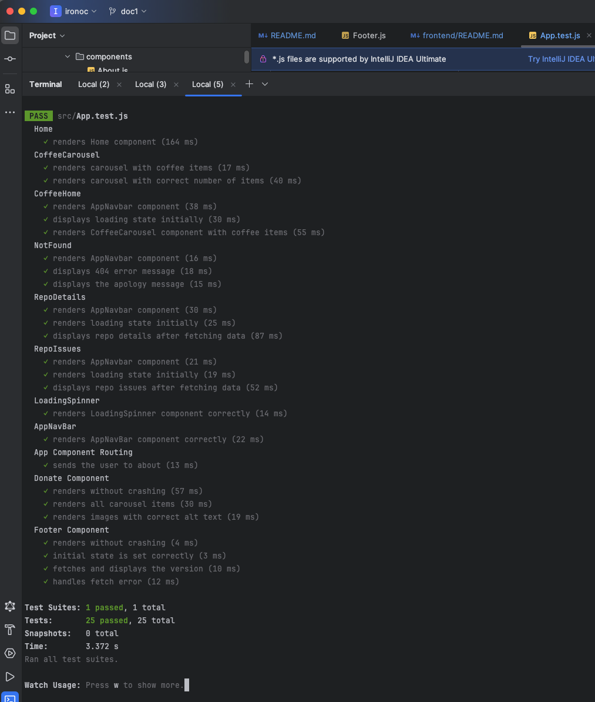
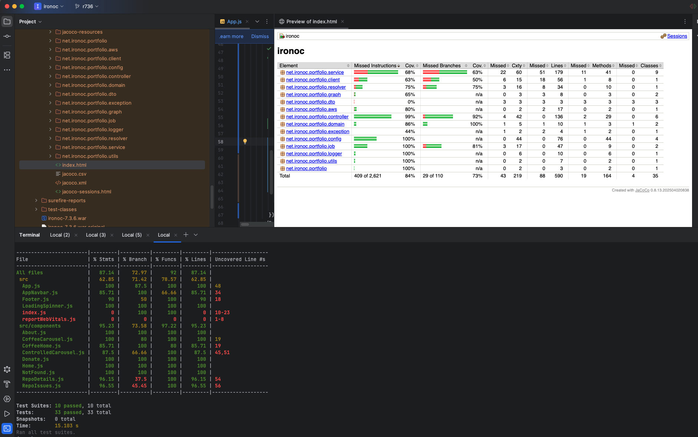
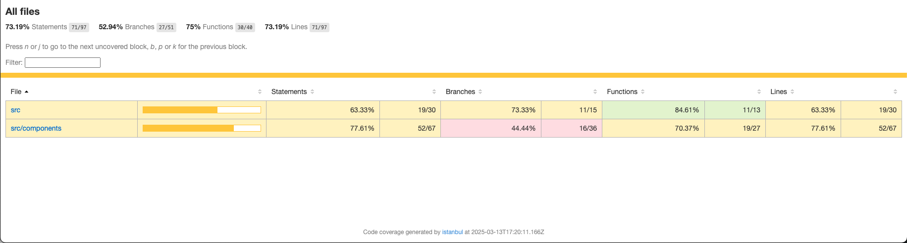
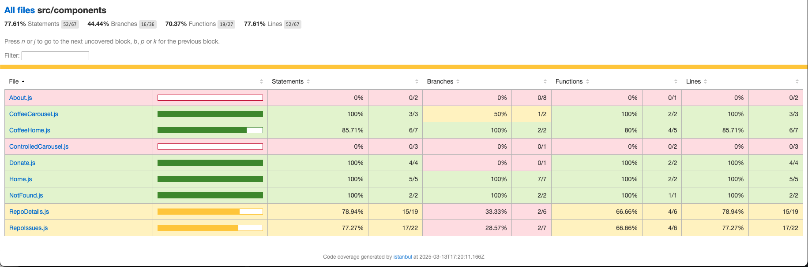
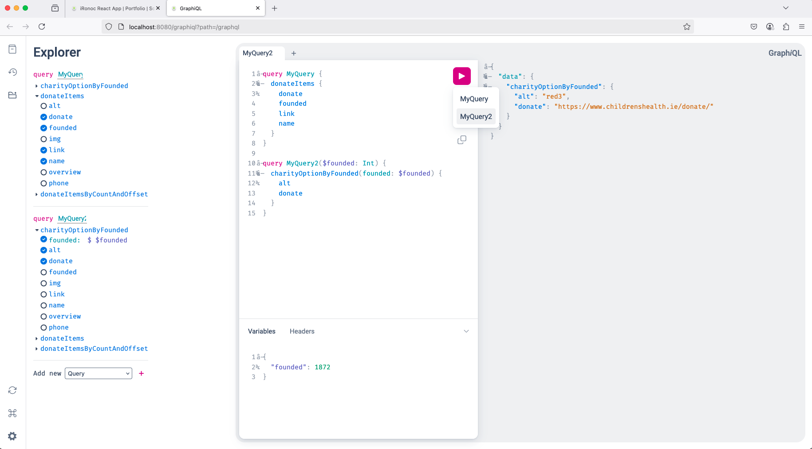

# ironoc

[](https://www.gnu.org/licenses/gpl-3.0)

[](https://github.com/conorheffron/ironoc/actions/workflows/maven-publish.yml)

[](https://github.com/conorheffron/ironoc/actions/workflows/aws.yml)

[](https://github.com/conorheffron/ironoc/actions/workflows/maven.yml)

[](https://github.com/conorheffron/ironoc/actions/workflows/npm-publish-packages.yml)

[](https://github.com/conorheffron/ironoc/actions/workflows/node.js.yml)


### Sonar

[](https://github.com/conorheffron/ironoc/actions/workflows/sonar.yml)

[](https://sonarcloud.io/summary/new_code?id=conorheffron_ironoc)

[Sonar Overall Summary](https://sonarcloud.io/summary/overall?id=conorheffron_ironoc&branch=main)

### Docker Image Repositories
- [ironoc Docker Hub Repository](https://hub.docker.com/repository/docker/conorheffron/ironoc/general)
- [ironoc GitHub Docker Container Registry](https://github.com/conorheffron/ironoc/pkgs/container/ironoc)

## Hosted at:
- [ironoc.net](https://ironoc.net)

## About
Personal website / portfolio  [https://www.ironoc.net/](https://www.ironoc.net/)

## Tech Stack
 - Java 25 (LTS), Spring Boot 4, ReactJs 19, Maven 4, HTML5+CSS, Docker / Bash, AWS, minikube, & kubectl.

##### Note: `iRonoc` is an active user of the `GitHub API` & `conorheffron` is a proud participant in the GitHub Developer Program.
- The `iRonoc` PM tool is designed to streamline project management by automating project navigation & issue tracking. 
- By leveraging the GitHub API, the aim is to enhance the developer experience and contribute to the vibrant GitHub ecosystem.
- As part of the GitHub Developer Program, it is important to commit to adhering to best practices & continuously improving the 
integration to provide value to users.

<a href="https://docs.github.com/en/get-started/exploring-integrations/github-developer-program">
    <div style="align:center">
        
    </div>
</a>

## See ironoc-frontend README [here](./frontend/README.md)

## Backend Project Structure
```shell
src
├── main
│   ├── java
│   │   └── net
│   │       └── ironoc
│   │           └── portfolio
│   │               ├── App.java
│   │               ├── aws
│   │               │   ├── AwsSecretManager.java
│   │               │   └── SecretManager.java
│   │               ├── client
│   │               │   ├── Client.java
│   │               │   └── GitClient.java
│   │               ├── config
│   │               │   ├── GraphiQlConfiguration.java
│   │               │   ├── IronocConfiguration.java
│   │               │   ├── Properties.java
│   │               │   ├── PropertyConfig.java
│   │               │   ├── PropertyConfigI.java
│   │               │   ├── PropertyKey.java
│   │               │   └── PropertyKeyI.java
│   │               ├── controller
│   │               │   ├── BrewGraphqlController.java
│   │               │   ├── CoffeeController.java
│   │               │   ├── DonateGraphqlController.java
│   │               │   ├── DonateRestController.java
│   │               │   ├── GitProjectsController.java
│   │               │   ├── PortfolioController.java
│   │               │   └── VersionController.java
│   │               ├── domain
│   │               │   ├── CoffeeDomain.java
│   │               │   ├── IngredientsDeserializer.java
│   │               │   ├── RepositoryDetailDomain.java
│   │               │   └── RepositoryIssueDomain.java
│   │               ├── dto
│   │               │   ├── Brew.java
│   │               │   ├── Donate.java
│   │               │   ├── DonateItemOrder.java
│   │               │   ├── LabelDto.java
│   │               │   ├── OwnerDto.java
│   │               │   ├── RepositoryDetailDto.java
│   │               │   └── RepositoryIssueDto.java
│   │               ├── enums
│   │               │   └── SortingOrder.java
│   │               ├── exception
│   │               │   └── IronocJsonException.java
│   │               ├── graph
│   │               │   ├── BrewsResolver.java
│   │               │   └── DonateItemsResolver.java
│   │               ├── job
│   │               │   ├── GitDetailsJob.java
│   │               │   └── GitDetailsRunnable.java
│   │               ├── logger
│   │               │   ├── AbstractLogger.java
│   │               │   └── LoggerI.java
│   │               ├── resolver
│   │               │   └── PushStateResourceResolver.java
│   │               ├── service
│   │               │   ├── AbstractGitCache.java
│   │               │   ├── CoffeeCacheService.java
│   │               │   ├── Coffees.java
│   │               │   ├── CoffeesCache.java
│   │               │   ├── CoffeesService.java
│   │               │   ├── GitDetails.java
│   │               │   ├── GitDetailsService.java
│   │               │   ├── GitProjectCache.java
│   │               │   ├── GitProjectCacheService.java
│   │               │   ├── GitRepoCache.java
│   │               │   ├── GitRepoCacheService.java
│   │               │   ├── GraphQLClient.java
│   │               │   ├── GraphQLClientService.java
│   │               │   └── PortfolioItemsResolver.java
│   │               └── utils
│   │                   └── UrlUtils.java
│   └── resources
│       ├── application.yml
│       ├── graphiql
│       │   └── index.html
│       ├── graphql
│       │   ├── charities.txt
│       │   ├── coffeesQuery.graphqls
│       │   └── ironocGraphSchema.graphql
│       ├── json
│       │   ├── brews.json
│       │   ├── donate-items.json
│       │   └── portfolio-items.json
│       └── static
│           ├── ironoc-banner.txt
│           └── swagger-ui
└── test
    ├── java
    │   └── net
    │       └── ironoc
    │           └── portfolio
    │               ├── AppTest.java
    │               ├── RemoteBrowserBasedIntTest.java
    │               ├── SeleniumConfig.java
    │               ├── aws
    │               │   └── AwsSecretManagerTest.java
    │               ├── client
    │               │   └── GitClientTest.java
    │               ├── config
    │               │   ├── IronocConfigurationTest.java
    │               │   ├── PropertyConfigTest.java
    │               │   ├── PropertyKeyTest.java
    │               │   └── TestIronocConfiguration.java
    │               ├── controller
    │               │   ├── BaseControllerIntegrationTest.java
    │               │   ├── BrewGraphqlControllerTest.java
    │               │   ├── CoffeeControllerIntegrationTest.java
    │               │   ├── CoffeeControllerTest.java
    │               │   ├── DonateGraphqlControllerTest.java
    │               │   ├── DonateRestControllerTest.java
    │               │   ├── GitProjectsControllerIntegrationTest.java
    │               │   ├── GitProjectsControllerTest.java
    │               │   ├── PortfolioControllerTest.java
    │               │   └── VersionControllerTest.java
    │               ├── graph
    │               │   ├── BrewsResolverTest.java
    │               │   └── DonateItemsResolverTest.java
    │               ├── job
    │               │   ├── GitDetailsJobTest.java
    │               │   └── GitDetailsRunnableTest.java
    │               ├── resolver
    │               │   └── PushStateResourceResolverTest.java
    │               ├── service
    │               │   ├── CoffeesServiceTest.java
    │               │   ├── GitDetailsServiceTest.java
    │               │   ├── GitRepoCacheServiceTest.java
    │               │   ├── GraphQLClientServiceTest.java
    │               │   └── PortfolioItemsResolverTest.java
    │               ├── utils
    │               │   ├── TestRequestResponseUtils.java
    │               │   └── UrlUtilsTest.java
    │               └── web
    │                   └── page
    │                       ├── AboutPage.java
    │                       ├── BrewsPage.java
    │                       ├── DonatePage.java
    │                       ├── HomePage.java
    │                       └── PortfolioPage.java
    └── resources
        ├── graphql
        │   ├── charities.txt
        │   ├── iRonocQuery.graphqls.SAMPLE
        │   └── query.graphql
        └── json
            ├── donate-items.json
            ├── test_coffees_expected_response.json
            ├── test_coffees_input_response.json
            ├── test_issues_response.json
            ├── test_parse_null_response.json
            ├── test_repo_detail_response.json
            └── test_response.json
```

## Run without cloning project:
```
docker run -d --restart=always -p 8080:8080 conorheffron/ironoc
```

## AWS CLI to pull required svc / user account credentials.
### Configure account, verify details & then generate ID/Keys/Tokens.
```shell
aws configure

aws iam get-user

aws sts get-session-token
```

## Add localhost proxy to frontend config (do not commit - only for local runs).


## Run after project checkout (JDK 25 & Maven 4 required)
### Build frontend & server side, along with Java Code Coverage report.
```shell
./mvnw clean package -U
```

#### View Java Code Coverage reports in Browser or Preview tab in IDE.
##### Path to reports is `target/site/jacoco/index.html`


##### View in browser at `http://localhost:63342/ironoc/target/site/jacoco/index.html?_ijt=s0hqlj2p4s6554gldritju13qr&_ij_reload=RELOAD_ON_SAVE`
###### Note: Change port as needed/identifier as this is URL generated during build process & opened via IDE window.


### Build & Run frontend on react development server, then run react test suite.
```shell
cd frontend

npm install [--force or --legacy-peer-deps]

npm run build

rpm run start

npm run test

npm run test:coverage
```
##### See the output below to verify the frontend test suite results.


##### See the output below to verify the test coverage for the frontend from the command line.


#### View Frontend Code Coverage reports in Browser or Preview tab in IDE.
##### Path to reports is `frontend/coverage/lcov-report/index.html`





### Run app
```shell
./mvnw -DAWS_ACCESS_KEY_ID="<val1>" \
    -DAWS_REGION=<val2> \
    -DAWS_SECRET_ACCESS_KEY="<val3>" \
    -DAWS_SESSION_TOKEN="<val4>" \
    spring-boot:run
```


### Build / Run (spin-up) Docker container:
```
docker image build -t ironoc .
docker compose up -d
docker logs ironoc-portfolio-1 -f
```


### Tear-down:
```
docker compose down
```

# Screenshot


# Local k8s cluster with Minikube:

MiniKube Install Notes for mac users
```
brew install kubectl
brew install virtualbox
brew install / upgrade minikube
```

```shell
Oracle VirtualBox Manager v7.1.4

% kubectl version     
Client Version: v1.30.2
Kustomize Version: v5.0.4-0.20230601165947-6ce0bf390ce3
Server Version: v1.31.0

% minikube version
minikube version: v1.34.0
commit: 210b148df93a80eb872ecbeb7e35281b3c582c61

% docker version
Client:
Version:           27.3.1
API version:       1.47
Go version:        go1.22.7
Git commit:        ce12230
Built:             Fri Sep 20 11:38:18 2024
OS/Arch:           darwin/amd64
Context:           desktop-linux
```

- Open terminal
```shell
%  minikube start --driver=docker                 
😄  minikube v1.35.0 on Darwin 15.3.1
🆕  Kubernetes 1.32.0 is now available. If you would like to upgrade, specify: --kubernetes-version=v1.32.0
✨  Using the docker driver based on existing profile
👍  Starting "minikube" primary control-plane node in "minikube" cluster
🚜  Pulling base image v0.0.46 ...
🏃  Updating the running docker "minikube" container ...
❗  Image was not built for the current minikube version. To resolve this you can delete and recreate your minikube cluster using the latest images. Expected minikube version: v1.34.0 -> Actual minikube version: v1.35.0
🐳  Preparing Kubernetes v1.31.0 on Docker 27.2.0 ...
🔗  Configuring bridge CNI (Container Networking Interface) ...
🔎  Verifying Kubernetes components...
    ▪ Using image docker.io/kubernetesui/metrics-scraper:v1.0.8
    ▪ Using image gcr.io/k8s-minikube/storage-provisioner:v5
    ▪ Using image docker.io/kubernetesui/dashboard:v2.7.0
💡  Some dashboard features require the metrics-server addon. To enable all features please run:

        minikube addons enable metrics-server

🌟  Enabled addons: storage-provisioner, default-storageclass, dashboard
🏄  Done! kubectl is now configured to use "minikube" cluster and "default" namespace by default


% kubectl cluster-info
Kubernetes control plane is running at https://127.0.0.1:63402
CoreDNS is running at https://127.0.0.1:63402/api/v1/namespaces/kube-system/services/kube-dns:dns/proxy

To further debug and diagnose cluster problems, use 'kubectl cluster-info dump'.


% minikube dashboard
🤔  Verifying dashboard health ...
🚀  Launching proxy ...
🤔  Verifying proxy health ...
🎉  Opening http://127.0.0.1:63612/api/v1/namespaces/kubernetes-dashboard/services/http:kubernetes-dashboard:/proxy/ in your default browser...
```

### Then change namespace in browser from default to ironoc-ns after 'kubectl create ns ironoc-ns'
- i.e. http://127.0.0.1:63612/api/v1/namespaces/kubernetes-dashboard/services/http:kubernetes-dashboard:/proxy/#/pod?namespace=ironoc-ns

### Open New tab in terminal & create deployment
```shell
% docker image build -t ironoc .
[+] Building 100.5s (11/11) FINISHED                                                                                                                                                                                                                                                        docker:desktop-linux
 => [internal] load build definition from Dockerfile                                                                                                                                                                                                                                                        0.0s
 => => transferring dockerfile: 284B                                                                                                                                                                                                                                                                        0.0s
 => [internal] load metadata for docker.io/library/eclipse-temurin:21-jdk                                                                                                                                                                                                                                   2.0s
 => [auth] library/eclipse-temurin:pull token for registry-1.docker.io                                                                                                                                                                                                                                      0.0s
 => [internal] load .dockerignore                                                                                                                                                                                                                                                                           0.0s
 => => transferring context: 2B                                                                                                                                                                                                                                                                             0.0s
.
.
.


% minikube image load ironoc:latest


% kubectl create ns ironoc-ns
namespace/ironoc-ns created


% kubectl apply -f k8s/ironoc.yaml --namespace=ironoc-ns
deployment.apps/ironoc-app-deployment created
horizontalpodautoscaler.autoscaling/ironoc-app-deployment-hpa-kbij created


% kubectl get pods --namespace=ironoc-ns
NAME                                     READY   STATUS    RESTARTS   AGE
ironoc-app-deployment-6d84f75b44-5xvgj   1/1     Running   0          8s


% kubectl get deployment --namespace=ironoc-ns
NAME                    READY   UP-TO-DATE   AVAILABLE   AGE
ironoc-app-deployment   1/1     1            1           105s


% kubectl expose deployment ironoc-app-deployment --type=NodePort --namespace=ironoc-ns

service/ironoc-app-deployment exposed


% kubectl get svc --namespace=ironoc-ns
NAME                    TYPE       CLUSTER-IP      EXTERNAL-IP   PORT(S)          AGE
ironoc-app-deployment   NodePort   10.98.229.246   <none>        8080:31602/TCP   6s


% minikube service ironoc-app-deployment --url --namespace=ironoc-ns
http://127.0.0.1:63455
❗  Because you are using a Docker driver on darwin, the terminal needs to be open to run it.
```

### Open New tab in terminal & tail logs
```shell
% kubectl get pods --namespace=ironoc-ns
NAME                                     READY   STATUS    RESTARTS   AGE
ironoc-app-deployment-6d84f75b44-5xvgj   1/1     Running   0          3m28s


% kubectl logs ironoc-app-deployment-6d84f75b44-5xvgj -f --namespace=ironoc-ns

java  -jar /app.war


_________ _______  _______  _        _______  _______
\__   __/(  ____ )(  ___  )( (    /|(  ___  )(  ____ \
   ) (   | (    )|| (   ) ||  \  ( || (   ) || (    \/
   | |   | (____)|| |   | ||   \ | || |   | || |
   | |   |     __)| |   | || (\ \) || |   | || |
   | |   | (\ (   | |   | || | \   || |   | || |
___) (___| ) \ \__| (___) || )  \  || (___) || (____/\
\_______/|/   \__/(_______)|/    )_)(_______)(_______/


2025-05-19T18:47:04.581Z  INFO 7 --- [           main] n.i.p.App                                : Starting App v7.3.7 using Java 21.0.7 with PID 7 (/app.war started by root in /)
2025-05-19T18:47:04.765Z  INFO 7 --- [           main] n.i.p.App                                : No active profile set, falling back to 1 default profile: "default"
2025-05-19T18:47:22.489Z  INFO 7 --- [           main] o.s.b.w.e.t.TomcatWebServer              : Tomcat initialized with port 8080 (http)
2025-05-19T18:47:22.788Z  INFO 7 --- [           main] o.a.c.c.StandardService                  : Starting service [Tomcat]
2025-05-19T18:47:22.790Z  INFO 7 --- [           main] o.a.c.c.StandardEngine                   : Starting Servlet engine: [Apache Tomcat/10.1.40]
2025-05-19T18:48:03.677Z  INFO 7 --- [           main] o.a.j.s.TldScanner                       : At least one JAR was scanned for TLDs yet contained no TLDs. Enable debug logging for this logger for a complete list of JARs that were scanned but no TLDs were found in them. Skipping unneeded JARs during scanning can improve startup time and JSP compilation time.
2025-05-19T18:48:04.178Z  INFO 7 --- [           main] o.a.c.c.C.[.[.[/]                        : Initializing Spring embedded WebApplicationContext
2025-05-19T18:48:04.181Z  INFO 7 --- [           main] w.s.c.ServletWebServerApplicationContext : Root WebApplicationContext: initialization completed in 58800 ms
2025-05-19T18:48:06.066Z  WARN 7 --- [           main] n.i.p.l.AbstractLogger                   : The job to pre-populate the cache of GitHub information is disabled.
2025-05-19T18:48:08.397Z  INFO 7 --- [           main] o.s.b.a.w.s.WelcomePageHandlerMapping    : Adding welcome page: class path resource [static/index.html]
2025-05-19T18:48:10.364Z  INFO 7 --- [           main] efaultSchemaResourceGraphQlSourceBuilder : Loaded 1 resource(s) in the GraphQL schema.
2025-05-19T18:48:11.493Z  INFO 7 --- [           main] o.s.b.a.g.GraphQlAutoConfiguration       : GraphQL schema inspection:
        Unmapped fields: {DonateItem=[donate, link, img, alt, name, overview, founded, phone], Query=[donateItemsByCountAndOffset]}
        Unmapped registrations: {Query.donateItemsSchemaMapping=DonateGraphqlController#donateItemsSchemaMapping[0 args], Query.charityOptionByDonateLink=DonateGraphqlController#charityOptionByDonateLink[1 args], Donate.charityOptions=DonateGraphqlController#charityOptions[1 args]}
        Unmapped arguments: {}
        Skipped types: []
2025-05-19T18:48:11.699Z  INFO 7 --- [           main] s.b.a.g.s.GraphQlWebMvcAutoConfiguration : GraphQL endpoint HTTP POST /graphql
2025-05-19T18:48:13.978Z  INFO 7 --- [           main] o.s.b.w.e.t.TomcatWebServer              : Tomcat started on port 8080 (http) with context path '/'
2025-05-19T18:48:14.061Z  INFO 7 --- [           main] n.i.p.App                                : Started App in 73.393 seconds (process running for 81.378)
2025-05-19T18:50:24.815Z  INFO 7 --- [nio-8080-exec-1] o.a.c.c.C.[.[.[/]                        : Initializing Spring DispatcherServlet 'dispatcherServlet'
2025-05-19T18:50:24.816Z  INFO 7 --- [nio-8080-exec-1] o.s.w.s.DispatcherServlet                : Initializing Servlet 'dispatcherServlet'
2025-05-19T18:50:24.821Z  INFO 7 --- [nio-8080-exec-1] o.s.w.s.DispatcherServlet                : Completed initialization in 5 ms
2025-05-19T18:50:27.308Z  INFO 7 --- [nio-8080-exec-5] n.i.p.l.AbstractLogger                   : Retrieved brews from GraphQL query, coffeeDomains=[name: 'Black Coffee' id: '1', name: 'Latte' id: '2', name: 'Caramel Latte' id: '3', name: 'Cappuccino' id: '4', name: 'Americano' id: '5', name: 'Espresso' id: '6', name: 'Macchiato' id: '7', name: 'Mocha' id: '8', name: 'Hot Chocolate' id: '9', name: 'Chai Latte' id: '10', name: 'Matcha Latte' id: '11', name: 'Seasonal Brew' id: '12', name: 'Svart Te' id: '13', name: 'Islatte' id: '14', name: 'Islatte Mocha' id: '15', name: 'Frapino Caramel' id: '16', name: 'Frapino Mocka' id: '17', name: 'Apelsinjuice' id: '18', name: 'Frozen Lemonade' id: '19', name: 'Lemonad' id: '20', name: 'Iced Coffee' id: '1', name: 'Iced Espresso' id: '2', name: 'Cold Brew' id: '3', name: 'Frappuccino' id: '4', name: 'Nitro' id: '5', name: 'Mazagran' id: '6']
```

### (clean-up & again after local testing complete)
```shell
% minikube delete 
🔥  Deleting "minikube" in docker ...
🔥  Deleting container "minikube" ...
🔥  Removing /home/.minikube/machines/minikube ...
💀  Removed all traces of the "minikube" cluster.
```

### Navigate to GraphQL Playground via Charity Options drop down or directly by the following link(s):
```
http://localhost:8080/graphiql?path=/graphql

or 

https://ironoc.net/graphiql?path=/graphql
```

