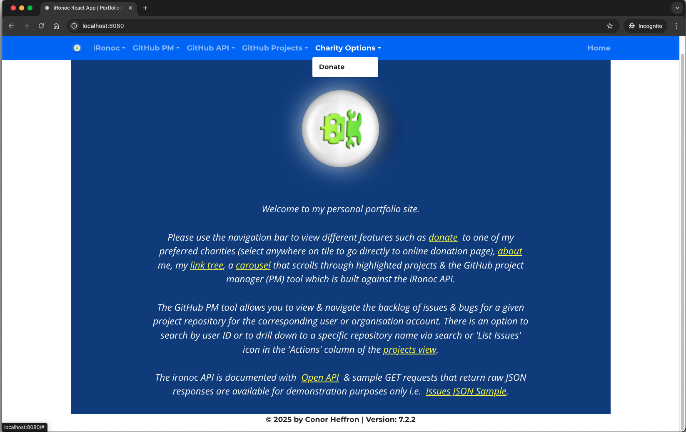

[](https://github.com/conorheffron/ironoc/actions/workflows/maven.yml)


# Docker Image
[ironoc Docker Hub Link](https://hub.docker.com/repository/docker/conorheffron/ironoc/general)

# Old Domain  (no longer supported)
~[ironoc website](http://www.ironoc.com)~

# About
Personal website / portfolio  http://www.ironoc.com/ (no longer hosted)

# Tech Stack
Java 21 (LTS), Spring Boot 3.3, Maven 3.8, HTML5+CSS, JQuery, Docker / Bash

# Run without cloning project:
```
docker run -d --restart=always -p 8080:8080 conorheffron/ironoc
```

# Run after project checkout (JDK 21 & Maven 3.8.3 required)
Build / Run App:
```
mvn clean package spring-boot:run
```


Build / Run (spin-up) Docker container:
```
docker image build -t ironoc .
docker compose up -d
```


Tear-down:
```
docker-compose down
```

# Screenshot



