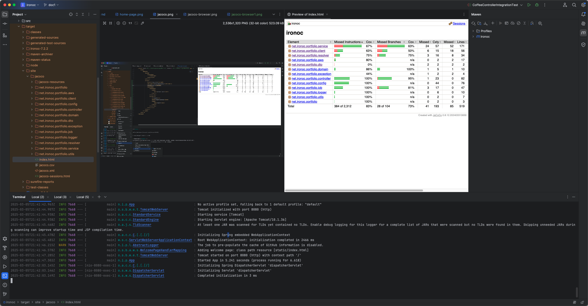

[](https://github.com/conorheffron/ironoc/actions/workflows/maven.yml)


[](https://github.com/conorheffron/ironoc/actions/workflows/aws.yml)

### Docker Image Repositories
- [ironoc Docker Hub Repository](https://hub.docker.com/repository/docker/conorheffron/ironoc/general)
- [ironoc GitHub Docker Container Registry](https://github.com/conorheffron/ironoc/pkgs/container/ironoc)

## Hosted at:
- [ironoc.net](https://me.ironoc.net)
- [ironoc load balancer](https://ironoc-lb-6a36dafeeca59581.elb.eu-north-1.amazonaws.com/)

## About
Personal website / portfolio  [https://www.ironoc.net/](https://www.ironoc.net/)

## Tech Stack
Java 21 (LTS), Spring Boot 3.4, ReactJs 18, Maven 3.8 or later, HTML5+CSS, 
    Docker / Bash, AWS, minikube, & kubectl.

## Run without cloning project:
```
docker run -d --restart=always -p 8080:8080 conorheffron/ironoc
```

## AWS CLI to pull required svc / user account credentials.
### Configure account, verify details & then generate ID/Keys/Tokens.
```shell
% aws configure

% aws iam get-user

% aws sts get-session-token
```

## Add localhost proxy to frontend config (do not commit - only for local runs).


## Run after project checkout (JDK 21 & Maven 3.8 or later required)
### Build frontend & server side, along with Java Code Coverage report.
```shell
mvn clean package
```

#### View Java Code Coverage reports in Browser or Preview tab in IDE.
##### Path to reports is `target/site/jacoco/index.html`



##### View in browser at `http://localhost:63342/ironoc/target/site/jacoco/index.html?_ijt=s0hqlj2p4s6554gldritju13qr&_ij_reload=RELOAD_ON_SAVE`
###### Note: Change port as needed/identifier as this is URL generated during build process & opened via IDE window.


### Run app
```shell
mvn -DAWS_ACCESS_KEY_ID="<val1>" \
    -DAWS_REGION=<val2> \
    -DAWS_SECRET_ACCESS_KEY="<val3>" \
    -DAWS_SESSION_TOKEN="<val4>" \
    spring-boot:run
```


### Build / Run (spin-up) Docker container:
```
docker image build -t ironoc .
docker compose up -d
docker logs ironoc-portfolio-1 -f
```


### Tear-down:
```
docker-compose down
```

# Screenshot


# Local k8s cluster with Minikube:

MiniKube Install Notes for mac users
```
brew install kubectl
brew install virtualbox
brew install minikube
```

```shell
Oracle VirtualBox Manager v7.1.4

% kubectl version     
Client Version: v1.30.2
Kustomize Version: v5.0.4-0.20230601165947-6ce0bf390ce3
Server Version: v1.31.0

% minikube version
minikube version: v1.34.0
commit: 210b148df93a80eb872ecbeb7e35281b3c582c61

% docker version
Client:
Version:           27.3.1
API version:       1.47
Go version:        go1.22.7
Git commit:        ce12230
Built:             Fri Sep 20 11:38:18 2024
OS/Arch:           darwin/amd64
Context:           desktop-linux
```

- Open terminal
```shell
% minikube start --driver=docker
😄  minikube v1.34.0 on Darwin 15.1.1
❗  Both driver=docker and vm-driver=virtualbox have been set.

    Since vm-driver is deprecated, minikube will default to driver=docker.

    If vm-driver is set in the global config, please run "minikube config unset vm-driver" to resolve this warning.
                        
✨  Using the docker driver based on user configuration
📌  Using Docker Desktop driver with root privileges
👍  Starting "minikube" primary control-plane node in "minikube" cluster
🚜  Pulling base image v0.0.45 ...
🔥  Creating docker container (CPUs=2, Memory=4000MB) ...
🐳  Preparing Kubernetes v1.31.0 on Docker 27.2.0 ...
    ▪ Generating certificates and keys ...
    ▪ Booting up control plane ...
    ▪ Configuring RBAC rules ...
🔗  Configuring bridge CNI (Container Networking Interface) ...
🔎  Verifying Kubernetes components...
    ▪ Using image gcr.io/k8s-minikube/storage-provisioner:v5
🌟  Enabled addons: storage-provisioner, default-storageclass
🏄  Done! kubectl is now configured to use "minikube" cluster and "default" namespace by default


% kubectl cluster-info
Kubernetes control plane is running at https://127.0.0.1:62645
CoreDNS is running at https://127.0.0.1:62645/api/v1/namespaces/kube-system/services/kube-dns:dns/proxy

To further debug and diagnose cluster problems, use 'kubectl cluster-info dump'.


% minikube dashboard
🔌  Enabling dashboard ...
    ▪ Using image docker.io/kubernetesui/dashboard:v2.7.0
    ▪ Using image docker.io/kubernetesui/metrics-scraper:v1.0.8
💡  Some dashboard features require the metrics-server addon. To enable all features please run:

        minikube addons enable metrics-server

🤔  Verifying dashboard health ...
🚀  Launching proxy ...
🤔  Verifying proxy health ...
🎉  Opening http://127.0.0.1:62706/api/v1/namespaces/kubernetes-dashboard/services/http:kubernetes-dashboard:/proxy/ in your default browser...
```

### Then change namespace in browser from default to ironoc-ns
- i.e. http://127.0.0.1:62706/api/v1/namespaces/kubernetes-dashboard/services/http:kubernetes-dashboard:/proxy/#/pod?namespace=ironoc-ns

### Open New tab in terminal & create deployment
```shell
% docker image build -t ironoc .
[+] Building 100.5s (11/11) FINISHED                                                                                                                                                                                                                                                        docker:desktop-linux
 => [internal] load build definition from Dockerfile                                                                                                                                                                                                                                                        0.0s
 => => transferring dockerfile: 284B                                                                                                                                                                                                                                                                        0.0s
 => [internal] load metadata for docker.io/library/eclipse-temurin:21-jdk                                                                                                                                                                                                                                   2.0s
 => [auth] library/eclipse-temurin:pull token for registry-1.docker.io                                                                                                                                                                                                                                      0.0s
 => [internal] load .dockerignore                                                                                                                                                                                                                                                                           0.0s
 => => transferring context: 2B                                                                                                                                                                                                                                                                             0.0s
.
.
.


% minikube image load ironoc:latest


% kubectl create ns ironoc-ns
namespace/ironoc-ns created


% kubectl apply -f k8s/ironoc.yaml --namespace=ironoc-ns
deployment.apps/ironoc-app-deployment created
horizontalpodautoscaler.autoscaling/ironoc-app-deployment-hpa-kbij created


% kubectl get pods --namespace=ironoc-ns
NAME                                     READY   STATUS    RESTARTS   AGE
ironoc-app-deployment-6d84f75b44-5xvgj   1/1     Running   0          8s


% kubectl get deployment --namespace=ironoc-ns
NAME                    READY   UP-TO-DATE   AVAILABLE   AGE
ironoc-app-deployment   1/1     1            1           105s


% kubectl expose deployment ironoc-app-deployment --type=NodePort --namespace=ironoc-ns

service/ironoc-app-deployment exposed


% kubectl get svc --namespace=ironoc-ns
NAME                    TYPE       CLUSTER-IP      EXTERNAL-IP   PORT(S)          AGE
ironoc-app-deployment   NodePort   10.98.229.246   <none>        8080:31602/TCP   6s


% minikube service ironoc-app-deployment --url --namespace=ironoc-ns
http://127.0.0.1:63455
❗  Because you are using a Docker driver on darwin, the terminal needs to be open to run it.
```

### Open New tab in terminal & tail logs
```shell
% kubectl get pods --namespace=ironoc-ns
NAME                                     READY   STATUS    RESTARTS   AGE
ironoc-app-deployment-6d84f75b44-5xvgj   1/1     Running   0          3m28s


% kubectl logs ironoc-app-deployment-6d84f75b44-5xvgj -f --namespace=ironoc-ns

java  -jar /app.war

Standard Commons Logging discovery in action with spring-jcl: please remove commons-logging.jar from classpath in order to avoid potential conflicts

  .   ____          _            __ _ _
 /\\ / ___'_ __ _ _(_)_ __  __ _ \ \ \ \
( ( )\___ | '_ | '_| | '_ \/ _` | \ \ \ \
 \\/  ___)| |_)| | | | | || (_| |  ) ) ) )
  '  |____| .__|_| |_|_| |_\__, | / / / /
 =========|_|==============|___/=/_/_/_/

 :: Spring Boot ::                (v3.4.0)

2024-12-14T17:50:40.926Z  INFO 7 --- [           main] n.i.p.App                                : Starting App v5.4.6 using Java 21.0.5 with PID 7 (/app.war started by root in /)
2024-12-14T17:50:41.028Z  INFO 7 --- [           main] n.i.p.App                                : No active profile set, falling back to 1 default profile: "default"
2024-12-14T17:50:48.042Z  INFO 7 --- [           main] o.s.b.w.e.t.TomcatWebServer              : Tomcat initialized with port 8080 (http)
2024-12-14T17:50:48.109Z  INFO 7 --- [           main] o.a.c.c.StandardService                  : Starting service [Tomcat]
2024-12-14T17:50:48.112Z  INFO 7 --- [           main] o.a.c.c.StandardEngine                   : Starting Servlet engine: [Apache Tomcat/10.1.33]
2024-12-14T17:51:26.598Z  INFO 7 --- [           main] o.a.j.s.TldScanner                       : At least one JAR was scanned for TLDs yet contained no TLDs. Enable debug logging for this logger for a complete list of JARs that were scanned but no TLDs were found in them. Skipping unneeded JARs during scanning can improve startup time and JSP compilation time.
2024-12-14T17:51:27.320Z  INFO 7 --- [           main] o.a.c.c.C.[.[.[/]                        : Initializing Spring embedded WebApplicationContext
2024-12-14T17:51:27.323Z  INFO 7 --- [           main] w.s.c.ServletWebServerApplicationContext : Root WebApplicationContext: initialization completed in 45872 ms
2024-12-14T17:51:28.210Z  INFO 7 --- [           main] n.i.p.l.AbstractLogger                   : GitDetailsRunnable running for userIds=[conorheffron]
2024-12-14T17:51:28.696Z  INFO 7 --- [           main] n.i.p.l.AbstractLogger                   : Triggering GET request: url=https://api.github.com/users/conorheffron/repos?per_page=100&page=1
2024-12-14T17:51:34.776Z  WARN 7 --- [           main] n.i.p.c.GitClient                        : GIT token not set, the lower request rate will apply
2024-12-14T17:51:35.912Z  WARN 7 --- [           main] n.i.p.l.AbstractLogger                   : Input stream already closed.
2024-12-14T17:51:35.912Z  INFO 7 --- [           main] n.i.p.l.AbstractLogger                   : Running GIT details job for userIds=[conorheffron], repositoryDetailDtos=[]
2024-12-14T17:51:35.914Z  INFO 7 --- [           main] n.i.p.l.AbstractLogger                   : GitDetailsRunnable completed for userIds=[conorheffron]
2024-12-14T17:51:36.925Z  INFO 7 --- [           main] o.s.b.a.w.s.WelcomePageHandlerMapping    : Adding welcome page: class path resource [static/index.html]
2024-12-14T17:51:40.857Z  INFO 7 --- [           main] o.s.b.w.e.t.TomcatWebServer              : Tomcat started on port 8080 (http) with context path '/'
2024-12-14T17:51:40.911Z  INFO 7 --- [           main] n.i.p.App                                : Started App in 62.867 seconds (process running for 68.625)
```

### (clean-up & again after local testing complete)
```shell
% minikube delete 
🔥  Deleting "minikube" in docker ...
🔥  Deleting container "minikube" ...
🔥  Removing /Users/conorheffron/.minikube/machines/minikube ...
💀  Removed all traces of the "minikube" cluster.
```
