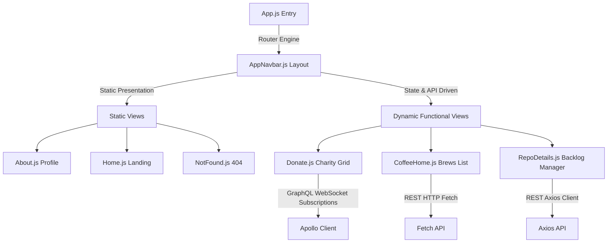
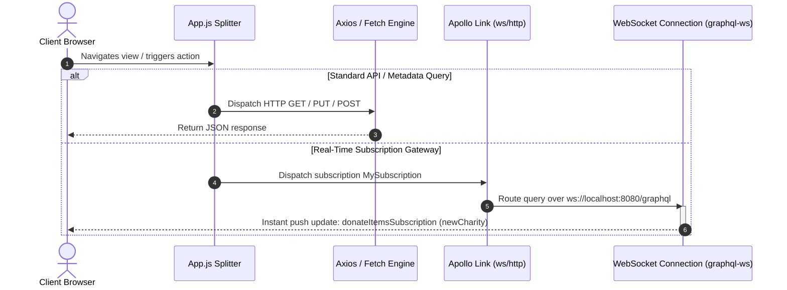

# @conorheffron/ironoc-frontend

The React-based Single-Page Application (SPA) user interface for the **iRonoc** personal portfolio and web application ecosystem. 

[](https://www.gnu.org/licenses/gpl-3.0)
[](https://github.com/conorheffron/ironoc/actions/workflows/npm-publish-packages.yml)
[](https://github.com/conorheffron/ironoc/actions/workflows/node.js.yml)

---

### 🔗 Project Source & Packages
- **GitHub Codebase Repository**: [conorheffron/ironoc](https://github.com/conorheffron/ironoc)
- **Frontend Source Directory**: [conorheffron/ironoc/tree/main/frontend](https://github.com/conorheffron/ironoc/tree/main/frontend)
- **Official NPM Registry**: [@conorheffron/ironoc-frontend](https://www.npmjs.com/package/@conorheffron/ironoc-frontend)

---

## 📐 Frontend Component Architecture & UX Render Flows

The frontend is implemented as a single-page React 19 application. It handles routing locally, renders structured layouts with components from MUI and React-Bootstrap, and integrates both REST APIs (via Axios/Fetch) and GraphQL endpoints (via Apollo Client).

### 1. Component Rendering Topology



### 2. Live Data Synchronizing Pipelines

To achieve reactive user experiences, the frontend splits its data retrieval strategies cleanly across protocols:



---

## 🛠️ Tech Stack & Key Libraries

- **Base Framework**: React 19 (ES6+ / JSX)
- **Routing Engine**: React Router 7
- **Data & Query Engines**: 
  - Apollo Client 3 (Hybrid GraphQL Queries, Mutations, and subscriptions)
  - `graphql-ws` (Secure RFC-compliant WebSocket transport)
  - Axios (REST client for repo detail fetching)
- **UI & Layout Framework**: Material-UI (MUI 7) & Bootstrap 5
- **Interactive Visualizations**: Recharts (for live repository issue backlogs)

---

## 📁 Project Directory Structure

```shell
frontend
├── package.json         # Package scripts & dependencies
├── public/
│   ├── index.html       # HTML5 entry wrapper
│   └── camera-roll.yml  # Config file for background image rosters
└── src/
    ├── App.js           # Core Router and Apollo Provider Link setups
    ├── AppNavbar.js     # Shared navigation navbar
    ├── Footer.js        # Shared page footer
    ├── components/      # View components
    │   ├── Home.js      # Landing page (implements Navy theme)
    │   ├── About.js     # Technical profile
    │   ├── Donate.js    # Charities grid (uses GraphQL WebSocket Subscriptions)
    │   ├── CoffeeHome.js# Brew cards & preparation details
    │   ├── RepoDetails.js# GitHub repo manager (Axios REST fetches)
    │   └── __tests__/   # Jest & React Testing Library suites
    └── utils/
        ├── activityTracker.js   # Telemetry beacon clicks dispatcher
        └── cameraRollConfig.js  # Loader helper for camera roll images
```

---

## 🚀 Getting Started (Development Quickstart)

### Prerequisites
- **Node.js**: `v24` (LTS) or higher recommended
- **NPM**: `v11` or higher recommended

### Local Installation & Setups
1. Clone the repository and navigate into the frontend folder:
   ```bash
   cd frontend
   ```
2. Clear any stale directory locks and clean install dependencies:
   ```bash
   rm -rf node_modules package-lock.json
   npm cache clean --force
   npm install --legacy-peer-deps
   ```
3. Run the application locally in development mode:
   ```bash
   npm start
   ```
   *Open [http://localhost:3000](http://localhost:3000) to view it in your browser. The page will auto-reload when you modify components.*

---

## 🧪 Testing & Code Coverage

Our frontend test coverage is thoroughly verified using **Jest** and **React Testing Library** (with virtualized JSDOM browser containers).

- **Execute Full Test Suite**:
  ```bash
  npm run test
  ```
- **Generate Local Istanbul/Istanbul Coverage Reports**:
  ```bash
  npm run test:coverage
  ```
  *Current overall frontend test coverage remains above **91% statement coverage**!*

---

## 🎨 Camera Roll Background Configuration

The rotating background image rosters for the **Home** (Landing) and **About** pages are dynamically driven by the static asset config file located at `public/camera-roll.yml`.

Example config:
```yaml
home:
  - navy-bg
about:
  - navy-bg
  - red-bg
  - teal-bg
```
*Supported theme image keys are `teal-bg`, `navy-bg`, and `red-bg`.*

---

## 📦 Production Builds

To compile and bundle the application into highly optimized, minified, and hash-mapped static assets ready for deployment:
```bash
npm run build
```
The compiled files will be output to the `build/` directory. When building via the backend Spring Boot maven plugin, these static resources are automatically packaged into the Tomcat `/static/` classpath registry inside the WAR artifact.
